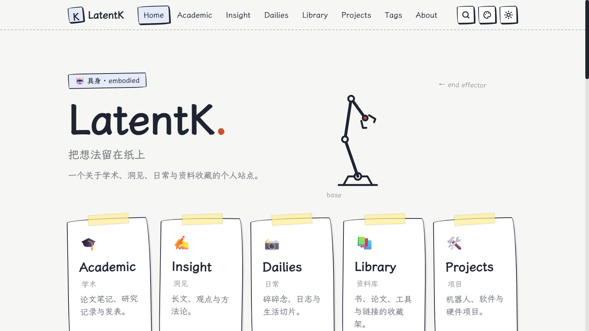

# LatentK · latentk.com

Kai 的个人网站。保留原来的具身主题首页、机械臂、研究方向、工作台、文章、日常与资料收藏，基于修复后的 Margin Notes 主题构建。

**[个人网站](https://slackkai.github.io/latentk.com/) · [内容后台](https://slackkai.github.io/latentk.com/admin/) · [更新指南](docs/CONTENT-EDITING.md) · [接入 latentk.com 域名](docs/DOMAIN.md)**



## 个人站与主题

| 用途 | 仓库 | 本地 Git remote |
| --- | --- | --- |
| 本网站，包含个性化配置与内容 | [slackkai/latentk.com](https://github.com/slackkai/latentk.com) | `origin` |
| 可复用主题及主题演示 | [slackkai/astro-margin-notes](https://github.com/slackkai/astro-margin-notes) | `theme` |

当前工作目录 `D:\Projects\latentk.com` 对应个人网站。正常 `git push` 推送到个人仓库；后台保存也只写入个人仓库。主题仓库保留独立的 Margin Notes 演示，不再作为个人网站部署目标。

个人版从原提交 `0638ed8` 恢复 LatentK / Kai、具身首页标识、研究方向、工具与硬件、页脚文案以及 `latentk.com` 项目条目，保留后续的代码修复、CMS 和部署功能。示例论文仍明确标记为示例。

## 日常更新

打开[个人站后台](https://slackkai.github.io/latentk.com/admin/)，首次使用时连接有权写入 `slackkai/latentk.com` 的 GitHub token。

1. 选择学术、洞见、日常、资料库或项目。
2. 编辑正文、字段和图片。
3. 发布时关闭“草稿”开关，保存。
4. 等待 GitHub Actions 的 **Deploy to GitHub Pages** 成功，网站自动更新。

后台的“站点设置”可修改站名、作者、简介、联系方式、Now 卡片和关于页的自我介绍。草稿只从生成的网站中隐藏，公开仓库的源文件仍然公开。详细操作见[更新指南](docs/CONTENT-EDITING.md)。

## 本地写作与开发

要求 Node.js ≥22.12，推荐 Node.js 24。

```sh
npm ci
npm run dev
```

开发服务器显示草稿。Chrome / Edge 打开本地 `/admin/`，选择 **Work with Local Repository**，授权这个项目目录，即可直接编辑本地内容。

命令行新建 Markdown 草稿：

```sh
npm run new -- insight my-first-post "文章标题"
```

页边批注、荧光笔、公式和代码高亮都是普通 Markdown：`:note[批注]`、`:mark[高亮]`、`$…$` 与 `$$ … $$`，后台工具栏有对应按钮，富文本与 Markdown 模式可无损切换。只有需要自定义 Astro 组件的 `.mdx` 文件才继续用代码编辑器维护。

## 配置位置

| 配置 | 文件 |
| --- | --- |
| 站名、作者、域名和联系方式 | `src/data/site.json` |
| 研究方向、工作台、首页、功能开关、配色、页脚 | `src/config.ts` |
| 五个板块正文 | `src/content/` |
| 最近在做 / 在读 / 在听 | `src/content/now/now.md` |
| 关于页自我介绍 | 后台“站点设置 → 关于页”，或 `src/content/about/about.md` |
| 关于页其余结构 | `src/pages/about.astro` |
| 内容管理字段、列表排序与筛选、上传图片压缩 | `cms.config.mjs` |
| 后台编辑器组件（批注 / 高亮 / 公式）与预览样式 | `public/admin/components.js`、`public/admin/preview.css` |
| `:note[]` / `:mark[]` 的渲染 | `src/utils/remark-notes.mjs` |

## 检查和部署

```sh
npm run check
npm test
npm run build
npm run verify
npm run preview
```

`npm run preview -- stop` 停止 Astro 的后台预览服务。`npm run test:production` 额外检查草稿、标签与配置开关，会重建 `dist`，执行后需要重新构建用于预览的版本。

提交到 `main` 后自动构建发布。工作流从个人仓库 Pages 设置读取域名与路径，因此自定义域名接入前使用 `/latentk.com/`，接入后使用根路径。

`src/data/site.json` 中已经设置 `https://latentk.com`，用于本地／独立构建。DNS 接通前，线上 Pages 工作流仍使用可访问的 GitHub Pages 地址。域名接入步骤和 DNS 记录见 [DOMAIN.md](docs/DOMAIN.md)。

主题继承的修复记录见 [REVIEW.md](docs/REVIEW.md)，主题首发记录见 [RELEASE-1.0.0.md](docs/RELEASE-1.0.0.md)。
