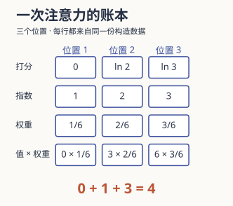

读注意力公式时，最容易发生的是：每个符号都认识，却不知道输出究竟怎样从输入长出来。

这次先只留下一个查询、三个位置和三个数值。把每一步记在一页底稿上，直到你可以指出“这里为什么是 4”。再回到 Transformer，复杂结构里仍然能找到这一个小动作。

## 底稿第一行：比较得到三个分数

构造一个一维查询 `Q = [1]`。三个键分别是 `0`、`ln 2`、`ln 3`，三个值分别是 `0`、`3`、`6`。它们只是为了便于手算选出的数字，没有语义标签。

查询与键点积后，得到三个分数：`0`、`ln 2`、`ln 3`。此时没有把值混合进去。你得到的是一份:mark[从哪里取多少信息的打分表]。

## 底稿第二行：总和为一，是怎样来的

softmax 先取指数，再除以指数总和。本例中，指数恰好是 `1、2、3`，和为 6，所以权重是 `1/6、2/6、3/6`。

然后取对应的值，计算：

$$
\frac16\times0+\frac26\times3+\frac36\times6=4.
$$

最大权重落在第三个位置，但输出仍混合了多个值，并没有简单复制“分数最高”的那一项。:note[真实向量中的分量通常不能逐一贴上人类语义。本例把值缩成一维，只为了让混合过程能手算。]

如果把三个分数都增加 100，结果会改变吗？先在底稿上写一个答案。

:::fold[核对：每个位置一起增加同一个数]
每个指数都乘上同一个因子，分子与分母里的因子抵消。因此 softmax 不变，输出仍是 4。这也解释了数值实现为什么常先减去最大分数，以避免指数溢出。
:::

## 底稿第三行：遮住一个位置，重算整份分配

现在禁止访问第三个位置。应在 softmax 之前遮住它，让那一项的权重变成零。剩余两项的指数仍是 1 和 2，却要重新归一化：

| 状态 | 三个权重 | 输出 |
| --- | --- | --- |
| 三个位置都可访问 | `1/6, 2/6, 3/6` | `4` |
| 第三个位置被遮住 | `1/3, 2/3, 0` | `2` |

如果只在混合以后把第三项贡献删掉，剩下的权重之和只有一半，结果会是 1。那不是这次遮罩想实现的运算。**遮罩改变了可用的信息，也改变了其余位置之间的分配。**

这份构造遮罩只演示“禁止一个位置”。解码器的因果遮罩还要按查询所在的位置决定哪些后续位置不可访问，不能直接把本例当成整张因果遮罩。

:::fold[不看答案，再试一遍]
把第三个值从 6 改成 12，键和查询保持不变。全部位置可访问时，输出变成 7；仍遮住第三项时，输出还是 2。

权重由查询与键决定，混合内容来自值。这个改动正好把两者分开。
:::

## 把这一页写成一般的矩阵

原论文的缩放点积注意力是：

$$
\mathrm{Attention}(Q,K,V)=\mathrm{softmax}\left(\frac{QK^\top}{\sqrt{d_k}}\right)V.
$$

本例 `d_k = 1`，缩放因子恰好为 1。推广到更高维时，再核对这份形状说明：

| 量 | 形状 | 一行代表什么 |
| --- | --- | --- |
| Q | `n_q × d_k` | 一个查询 |
| K | `n_k × d_k` | 一个键 |
| 打分表 | `n_q × n_k` | 这个查询对各位置的分数 |
| V | `n_k × d_v` | 一个位置可交出的值 |
| 输出 | `n_q × d_v` | 这个查询得到的混合结果 |

softmax 沿键这一维归一化。序列增加位置时，打分表跟着增加行或列；它不是一个不随输入长度改变的固定参数表。

除以 $\sqrt{d_k}$ 的动机，是控制点积尺度，减轻 softmax 过度集中时的小梯度问题。:note[原论文用独立、零均值、单位方差分量说明点积方差随 d_k 增长。这是动机模型，不是对训练中所有向量分布的证明。]

## 放回 Transformer，先认三处接线

:::steps
1. **编码器的自注意力。** Q、K、V 来自同一段输入的表示。
2. **解码器的自注意力。** 输入来源相同，但因果遮罩限制它访问后续位置。
3. **编码器—解码器注意力。** 查询来自解码器，键和值来自编码器输出。
:::

同一份账本在三处使用，区别是信息从哪里来、允许访问哪些位置。多头则让输入经过不同的可学习投影，分别计算，再拼接与投影：

$$
\mathrm{MultiHead}(Q,K,V)=\mathrm{Concat}(\mathrm{head}_1,\dots,\mathrm{head}_h)W^O.
$$

多个头提供不同表示子空间。没有具体观测时，不必把某一个头命名为“语法头”或“指代头”。原始 Transformer 还包括前馈网络、残差与归一化；:mark[注意力是一种信息混合运算]，并不独自承担整台模型的工作。

## 剩下的一条线索：顺序从哪里进来

原模型把正弦与余弦位置编码加到 token 嵌入上，给不依赖递归的结构提供位置信息。它的目的不同于刚才的权重分配。

论文报告，学习的位置嵌入与正弦方案取得近似结果，并把可能外推到更长序列作为选择正弦的理由。它没有保证模型一定能在更长输入上保持性能。:note[原始论文的结构和位置方案不应直接等同于所有现代 Transformer 实现。本文也没有复现它的翻译实验。]

继续看[原论文 §3–4](https://arxiv.org/html/1706.03762v7)时，先在每个注意力模块旁写两项：Q/K/V 的来源、遮罩挡住的位置。你已经有了能够检查这些接线的小底稿。

## 留一份可以自己改的算式

[attention_check.py](./attachments/attention_check.py)用 Python 3.10+ 标准库复算本例，检查整体平移不变性、遮罩与换值的结果。它不是 Transformer 实现，只是一份可以修改后重算的账本。

读到这里，试着把所有公式遮住，用一句话说明输出 4 的来历。能把“打分”和“混合”分开讲，比记住 Q、K、V 三个字母更接近理解。
