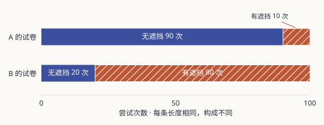
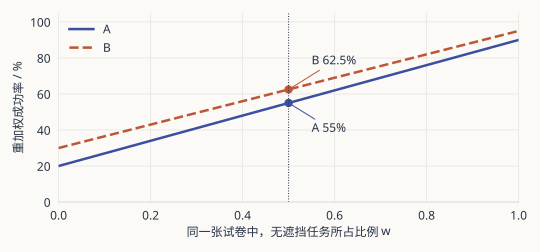
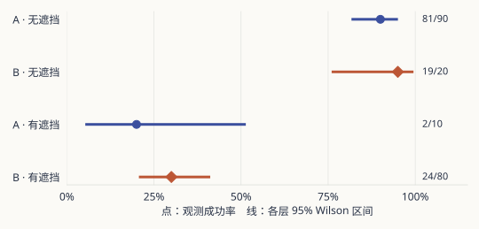

两份抓取测试，各做了一百次。A 成功 83 次，B 成功 43 次。

如果你只允许自己带走这两个数字，A 很容易胜出。如果还允许带走一张原始记录，事情就会变得不同。我们从成绩单的第一页读起，把那些没有印在大数字旁边的条件逐一找回来。

以下计数全部是教学构造，不是真机实验。图表使用同一份 [results.csv](./attachments/results.csv)，每一处百分数都能复算。

::::layout{cols=2}
:::postit[A 的第一页]
**83 / 100**

看起来更好的总分。
:::
:::postit[B 的第一页]
**43 / 100**

看起来落后的总分。
:::
::::

## 第一张图：分数之前，先看试卷

<figure>
<picture><source media="(max-width: 640px)" srcset="./attachments/test-mix-mobile.svg"></picture>
<figcaption>一百次与一百次：相同分母，不同试卷。</figcaption>
</figure>

A 大部分时间在做简单题，B 大部分时间在做难题。它们的分母都是 100，测试内容却不一样。

分组记录提供了更具体的观察：

| 场景 | A：成功 / 尝试 | B：成功 / 尝试 |
| --- | --- | --- |
| 无遮挡 | 81 / 90 = 90% | 19 / 20 = 95% |
| 有遮挡 | 2 / 10 = 20% | 24 / 80 = 30% |
| 原始合计 | 83 / 100 = 83% | 43 / 100 = 43% |

B 在每一层的观测成功率都高一点，合计却低得多。原因不是它合起来以后突然变弱，而是两种任务的权重不同。

这份辛普森悖论例子让一个容易忘记的事实显形：**合并数据也是一种加权。** 权重不一定写在结论里，却已经参与了结论。

:::fold[先试着复原第一页，再打开答案]
A 的无遮挡占比是 0.9，所以总成功率是 `0.9 × 0.9 + 0.1 × 0.2 = 0.83`。

B 的无遮挡占比是 0.2，所以是 `0.2 × 0.95 + 0.8 × 0.3 = 0.43`。

同一层内的成功率没改，选择的试卷构成不同，就能得到第一页的排序。
:::

## 第二张图：给它们同一张试卷

现在先明确我们为哪种任务选策略。假设目标分布是无遮挡、有遮挡各一半，就给两者使用同一份权重。

<figure>
<picture><source media="(max-width: 640px)" srcset="./attachments/common-test-mobile.svg"></picture>
<figcaption>共同权重改变，两条线一起变；层内成功率保持不变。</figcaption>
</figure>

以无遮挡占比 $w$ 表示同一张试卷：

$$
\hat p_A(w)=0.9w+0.2(1-w),\qquad
\hat p_B(w)=0.95w+0.3(1-w).
$$

五五开时，A 是 55%，B 是 62.5%，相差 **7.5 个百分点**。这不是相对提高 7.5%，也不是又做了一轮实验；我们只是按已有层内结果重加权。

把两式相减，会得到 `0.1 − 0.05w`。当 $w$ 从 0 走到 1，差值仍为正。在这份数据里，只要使用同一组非负权重，A 就无法重新领先。:note[这里讨论的是固定观测成功率的排序。真实成功概率是否也这样，还要考虑样本量与估计误差。]

五五开并不天然最公平。仓库整理与杂乱桌面可能面对不同任务分布。更重要的约定是：看结果之前就说明替谁选，再让两种方法接受同一把尺子。

## 第三张图：把分母放回每个点旁边

共同权重下 B 的点估计更高，是否已经足以宣布 B 更可靠？先看各层有多少数据。

<figure>
<picture><source media="(max-width: 640px)" srcset="./attachments/uncertainty-mobile.svg"></picture>
<figcaption>点的精度受分母影响。区间不是一次结果的保证，也不是差值检验。</figcaption>
</figure>

A 的困难层只有 2 / 10。对应的 95% Wilson 区间约为 5.7%–51.0%。把这个点写成“20.0000%”，不会让它多出任何信息。

区间提醒我们估计的精度。在独立、同成功概率的伯努利抽样假设下，置信区间的覆盖解释针对重复使用这套方法；不是说这一次固定真值有 95% 的概率落在区间里。Wilson 的有限样本覆盖也是近似的。

还有两件事不在这张图里：加权差值的置信区间，以及两种策略差异的显著性检验。**两条区间是否重叠，不是这里的万能判据。**

同一个杯子反复抓一百次，也不自动代表一百个独立物体的证据。结论希望推广到新物体、新场景还是新日期，决定了要怎样安排抽样与分析。

## 现在给这份报告写一句评语

先在纸上写你的版本，再展开下面这一份。

:::fold[一份能够对得上三张图的评语]
原始测试的任务分配不同，83% 与 43% 不适合直接排名。按预先约定的等权目标分布，A、B 的点估计为 55% 与 62.5%。但困难层尤其缺少 A 的观测，还应补充共同分布下、保留逐次记录的评估，才能判断差值有多可靠。
:::

它没有把“看见的总分”“重加权的估计”和“还不知道的差异”揉成一句话。这是这份笔记真正希望保留下来的阅读习惯。

## 下一张成绩单，先索要哪一页

不一定先要更多小数位。先索要成功定义、任务分配与逐次结果。再问有没有重试、排除或提前停止，这些回合怎样计入分母。成功率之外还可能需要恢复时间、耗时和风险指标，取决于真实任务。

:::steps
1. **开跑前写条件。** 定义成功、测试分布与预算，避免看见输赢后再换尺子。
2. **开跑时留记录。** 保存每次的场景、结果与失败／排除原因，让合计能被拆开。
3. **写结论时分层。** 分清观察、估计与推广，说明还缺哪一层证据。
:::

## 把这三张图带回自己的报告

下载 [results.csv](./attachments/results.csv) 和 [analyze.py](./attachments/analyze.py)，放在同一目录，执行 `python analyze.py`（Python 3.10+，仅标准库）。脚本打印混合比例、等权估计与各层区间；不做差值显著性检验。

需要检查共同权重时，可单独打开[重配试卷](./attachments/workbench/index.html)；需要感受样本波动时，可打开[重复试验页](./attachments/sampling/index.html)。它们是可选工具，三张图和正文已经给出了完整论证。

方法来源：[Simpson（1951）](https://doi.org/10.1111/j.2517-6161.1951.tb00088.x)讨论合并与分组的解释问题；[Wilson（1927）](https://doi.org/10.1080/01621459.1927.10502953)是区间方法的来源。本站没有把这些方法视为真实机器人部署的充分条件。
