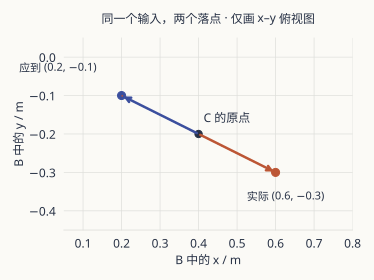

程序把目标写成了 `(0.6, -0.3, 1.5)` 米。标定记录说，同一个点应该是 `(0.2, -0.1, 1.5)` 米。

最奇怪的是：把程序给出的点再转回相机坐标，恰好回到了原来那份输入。正向和逆向函数接在一起，往返测试亮了绿灯。目标却仍在另一边。

这份案卷不需要启动工作台。你可以在纸上查完：每次只打开一条证据，写下它能排除什么，再读下一页。所有坐标都是教学构造；没有机器人运动，也没有真实标定结果。

## 封面里没有告诉你的约定

相机坐标系叫 C，基座坐标系叫 B。我们用米和列向量，并把 `R_BC` 定义为“输入 C，输出 B”。

独立测好的路标是：C 的原点位于 B 中的 `(0.4, -0.2, 0.5)`；C 的正 x 指向 B 的正 y，C 的正 y 指向 B 的负 x，正 z 不变。

这些对应关系来自题目的几何约定，**不是待测程序自己生成的答案**。如果连预期值也让同一个函数生成，后面再多的绿灯都可能只是它在和自己对答案。:note[实际项目应保留外部测量或独立夹具的来源与误差范围。本文把路标设为精确值，是为了单独讨论方向问题。]

眼下只列三种候选解释：旋转方向反了、平移多了十厘米、毫米误当成米。这是本题的有限候选集，不是所有坐标故障的全集。

## 第一页：一个通过的原点

把 C 的原点送进去，程序返回 `(0.4, -0.2, 0.5)`。与独立路标一致。

先写一个判断：这个结果检查了平移、旋转，还是两者都检查了？

:::fold[打开这一页的批注]
对输入零向量，旋转部分的结果仍然是零，只剩平移。因此原点正确，能排除本题的固定平移偏差，却无法区分正确旋转、反向旋转和尺度错误。

原点不是一个坏测试。它只是只问了一个小问题。
:::

## 第二页：把零换成一个方向

现在沿 C 的 x 走十厘米。独立路标说，B 中的 y 应从 −0.2 变成 −0.1；程序却把它变成了 −0.3。

再沿 C 的 y 走十厘米。本应沿 B 的负 x 移动，程序却沿正 x 走。

| C 中的测试点 / m | 独立预期的 B / m | 程序实际给出的 B / m |
| --- | --- | --- |
| `(0, 0, 0)` | `(0.4, -0.2, 0.5)` | `(0.4, -0.2, 0.5)` |
| `(0.1, 0, 0)` | `(0.4, -0.1, 0.5)` | `(0.4, -0.3, 0.5)` |
| `(0, 0.1, 0)` | `(0.3, -0.2, 0.5)` | `(0.5, -0.2, 0.5)` |

方向相反，步长却仍是十厘米。在这份候选集中，线索开始指向旋转使用的方向，而不是一条固定偏移或千倍尺度差。

**有用的测试让不同解释给出不同结果。** 如果再测十个原点，测试次数更多，信息却没有增加。

:::fold[两个隔壁案卷会留下什么脚印？]
若本题只有 B 的 x 平移多了 0.1 m，原点就会返回 `(0.5, -0.2, 0.5)`；各方向的位移仍正确，只是整组点一起挪开。

若输入被放大了 1000 倍，原点仍正确，但 C 的 `(0.1, 0, 0)` 会变成 B 的 `(0.4, 99.8, 0.5)`。方向可能对，尺度却完全不对。

这两份反例帮助你判断该选什么点。它们不意味着看到同一种脚印，就已经证明了真实故障的唯一来源。
:::

## 第三页：那张绿灯成绩单

正确的变换应是：

$$
p_B=R_{BC}p_C+t_{BC},\quad
R_{BC}=\begin{bmatrix}0&-1&0\\1&0&0\\0&0&1\end{bmatrix},\quad
t_{BC}=\begin{bmatrix}0.4\\-0.2\\0.5\end{bmatrix}.
$$

程序误用了 `R_BC` 的转置，逆向函数又恰好按这个错误定义求逆。两者搭在一起，当然能回去：

$$
R_{BC}\big((R_{BC}^{\top}p_C+t_{BC})-t_{BC}\big)=p_C.
$$

就像拿反地图走出去，再沿同一张反地图原路返回。能回到起点，没有证明中途到的是正确地址。

往返、距离保持和独立路标，各自检查不同的事。它们可以互相补充，不能把一个“内部一致”的成绩替换成“与外部约定一致”。

## 第四页：为什么补一条偏移会越修越怪

目标点是 `(0.1, 0.2, 1.0)`。正确旋转先得到 `(−0.2, 0.1, 1.0)`，再加平移；错误旋转则得到 `(0.2, −0.1, 1.0)`。

这一次差了 `(0.4, −0.2, 0)`。拿它作补偿，能把这一点修正。但换一个输入，误差也会变：

$$
\Delta p=(R_{BC}^{\top}-R_{BC})p_C.
$$

问题依赖输入，一条固定偏移当然解释不了它。修复应落在旋转方向的约定上，而不是给每个新位置另记一个补丁。

## 结案时留下什么

这次至少留下四件东西：原始失败点、预期值的独立来源、最小修改、修改后未参与诊断的回归点。先验证原点、三个方向和原目标，再看更广的场景。

下载 [frame_checks.py](./attachments/frame_checks.py)，用 Python 3.10+ 执行 `python frame_checks.py`。脚本只用标准库，会复算这份案卷，并打印那个“错误正逆函数仍能往返”的反例。表格原始值也保留为 [case-evidence.csv](./attachments/case-evidence.csv)。

:::postit[数值对了，还不能直接宣布抓取修好]{warn}
真实链路还有时间同步、深度单位、工具中心点、规划与执行。继续验证哪一环，要看新的失败证据。本文没有涵盖硬件验收；构造矩阵也不能代替相机自己的坐标约定。
:::

[ROS REP-103](https://www.ros.org/reps/rep-0103.html)是单位与坐标约定的来源入口。若想换几个测试点，原有的[可重开案卷](./attachments/workbench/index.html)仍可单独打开；正文的结论与复算不依赖它。

下次测试一片绿灯时，可以先在记录边上写一个很短的问题：**这些灯，是在检查它符合世界，还是只在检查它符合自己？**
