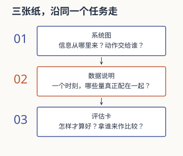

听到这样一句话，你可能认识其中每个缩写，却不知道它们怎样接在一起：

> 用遥操作采演示，以图像和本体状态训练策略，再到未见过的物体上测成功率。

这份路线就从这句话开始。三天以后，不要求你实现整套系统；希望你能指出：谁提供信息，谁决定动作，动作怎样执行，最后拿什么判断它做得好。



这是一份资源指南，可以放在真正项目开始前，也可以拿来检查已经接手的工作。每张纸都有可编辑的下载版，正文给一个构造例子；无需在浏览器里完成打卡，也不以勾完术语判断是否入门。

**三天是安排学习的容器，不是掌握领域的保证。** 某一环卡住，可以停下来多用一天。比起不断往术语清单上打勾，留下一件自己能够解释的产物更有用。

## 第一天：先画一个“拿起杯子”的闭环

先把任务写成一句话：机械臂看见桌上的杯子，夹起它，放到指定位置。杯子与环境是构造例子，不表示本站完成过这项实验。

从相机开始画：

```text
相机、关节传感器 → 观测 → 策略或规划 → 动作目标
       ↑                                 ↓
       └──────── 环境变化 ← 底层控制与机器人
```

箭头比名词更重要。图像不是动作，目标位置也不是电机已经到达的位置。底层控制负责把请求变成实际运动；传感器再告诉系统发生了什么。

### 只认识图上马上要用的量

| 量 | 先能解释到哪里 |
| --- | --- |
| 关节角、关节速度 | 描述机器人自身状态；不同于手在空间中的位置 |
| 位置、姿态、位姿 | 点在哪、朝哪；位姿把两者放在一起 |
| 正运动学、逆运动学 | 从关节配置算末端位姿；或为末端目标求关节配置 |
| 观测、动作 | 策略收到什么，以及输出给哪个接口 |
| 控制频率、延迟 | 多久更新一次，收到的信息是哪个时刻的 |

这天先不背所有控制方式。只确认例子里的动作到底是关节位置目标、速度还是力矩；接口没说清时，“网络输出七个数”还不能解释系统。

可以打开本站的[坐标故障案卷](../insight/debugging-coordinate-frames/index.md)，做一个原点检查和一个非零方向检查。目的不是学完几何，而是感受“同一个点，用错约定会去另一处”。

### 第一天留下什么

画一张不超过一页的系统图，在每条箭头旁写量、单位和来源。最后遮住原图，解释相机画面怎样影响机械臂下一步动作。解释断开的地方，就是待补基础。

下载 <a href="./attachments/embodied-system.md" download>第一张：系统图工作纸</a>。写不清的箭头可以留白，别先用“端到端”把它盖住。

:::fold[看一份填了半张的例子]
任务：抓起桌面杯子并放到指定位置。

已知：相机提供图像，关节传感器提供角度；策略输出一个目标，再交给底层控制执行。

仍空着：目标是绝对位姿还是增量？使用哪个坐标系？图像与关节状态是否来自同一时刻？

这个例子还不能运行。三处空白比一句“网络直接控制机械臂”更明确地指出下一步需要问什么。
:::

:::fold[视觉、深度、触觉、本体感觉怎么放？]
它们都可能提供观测，但量到的对象、时间和误差不同。图像看外观，深度提供距离相关信息，关节传感器描述自身状态，触觉与接触有关。先问某个任务缺什么信息，再决定要不要增加一种模态；“信息更多”不自动等于策略更好。
:::

## 第二天：沿一份演示数据往下走

继续昨天的杯子。由人遥操作完成几次动作，记录各时刻的观测与控制请求，这些轨迹可以成为演示数据。

先不讨论大模型。最简单的学习问题是：看到这些观测时，能否预测演示者下一步给出的动作？行为克隆用这种监督关系学习策略；奖励驱动的强化学习，则把交互结果与回报也纳入学习问题。这里先分清“答案从哪来”，不把它们看成互不相关的名词。

行为克隆与闭环中的分布变化，可继续读 MIT 开放教材的[模仿学习章节](https://underactuated.mit.edu/imitation.html)。本页用它核对基本概念，不宣称复现其中的方法。

### 一条数据，不是一张图片

为一个假想采集文件写说明：

```text
episode_id：一次尝试的标识
timestamp：观测与动作的时间约定
observation：图像、关节状态，以及它们的单位与尺寸
action：输出接口、单位、是否经过缩放
outcome：成功、失败、超时及其判定依据
```

这些是说明字段的例子，不是通用数据格式标准。换工具时应查它自己的定义。

问一句具体的问题：图像来自上一拍，动作记录在下一拍，它们怎样配对？昨天的系统图在这里就有了用处。[迟到的反馈](../insight/feedback-delay/index.md)也能帮助你看见时序的后果。

### 训练、验证和测试先分开

不要随机拆散同一次轨迹的邻近帧，就宣布模型已经见过独立测试。杯子、背景和运动都可能非常相近。先说明希望推广到什么，再按相应单位划分：不同轨迹、物体或场景，回答的泛化问题并不相同。

如果训练损失很低，还要问部署时会不会走到演示里很少出现的状态。在自己的错误动作之后继续预测，与沿着专家轨迹预测，不是同一个输入条件。

### 第二天留下什么

写一份短的数据说明，能让另一个人判断观测与动作怎样对应、各集合怎样划分。再给一段失败轨迹写一句解释，明确哪些是看见的，哪些只是猜测。

下载 <a href="./attachments/embodied-data.md" download>第二张：数据说明工作纸</a>。至少检查一条原始记录，再填写“图像”和“动作”这两个字段的形状、单位与时间。

:::fold[为什么工作纸要求先挑一条数据？]
“十万条高质量数据”没有告诉你一条记录里装了什么。如果先看到一张图、一组关节状态和一个动作，就能追问：图像是不是晚到了一帧？动作是在输出前还是执行后记录？最后一帧怎样处理？

数据说明的用途，是让别人能复查这些约定。它不需要在第一天就涵盖所有数据格式。
:::

:::fold[Diffusion Policy、VLA、世界模型现在要学多少？]
这轮先只把它们记成后续查阅入口，不声称一张术语卡能定义完整方法。遇到具体项目时，回到它的论文和实现，核对输入、输出、训练目标与执行过程。没有这四件事，知道名字仍然不足以解释项目。
:::

## 第三天：让一项“改进”接受检查

现在有人提出：增加触觉，应该能抓得更稳。

这个想法合理，却还不是实验结论。先问现有系统怎样失败；如果失败主要来自坐标方向错误，增加模态未必解决它。一个研究问题要说明正在修哪一类不足，以及为什么新信息可能有帮助。

### 先写同一张试卷

| 约定 | 开跑前需要回答 |
| --- | --- |
| 成功定义 | 只抬起，还是持续保持并完成放置？检查时刻是什么？ |
| 任务分布 | 哪些物体与场景，各占多少？哪些没在训练中出现？ |
| 对照方法 | 没有触觉时用什么方案，其他条件是否可比？ |
| 比较预算 | 数据量、训练资源、测试次数怎样分配？ |
| 失败与排除 | 超时、重试和异常回合怎样记录？ |

去[三张成绩单图](../academic/success-rate-is-not-evidence/index.md)复算一次共同权重。你会看到，同样两个策略，测试分配不同，总分就可能讲出另一个故事。

消融实验是在一定条件下移除或改变一个部分，观察差异；它帮助检查贡献，却不是一次“关掉模块”就完成因果证明。资源与其他设计也要保持可比，解释要跟随证据。

### 再读一篇论文，而不是再收十个标题

先读摘要与任务描述，再找系统图和实验设置。用昨天的数据说明去问：输入是什么，动作是什么，数据怎样得到，测试与训练怎样分开？最后再深入方法。

论文里的结果是作者报告的；你复述它，不表示自己复现过。自己的笔记应保留原文位置、使用条件和还没看懂的地方。

### 第三天留下什么

写一张评估卡：问题、对照、任务分布、成功定义、需要留下的逐次记录。然后回到开头那句话，用自己的话拆开讲一次。若“成功率”后面仍然没有分母与条件，就继续补这一环。

下载 <a href="./attachments/embodied-evaluation.md" download>第三张：评估卡工作纸</a>。它把待填的条件与实际结果分开，避免一张空计划表被误读成已经完成的实验。

## 工作纸填不下去时，查哪份资料

| 留白的位置 | 先补哪一层 | 能检查到什么 |
| --- | --- | --- |
| 单位与坐标不清 | [ROS REP-103](https://www.ros.org/reps/rep-0103.html)与设备接口说明 | 量的单位、方向和约定是否一致 |
| 专家数据怎样变成策略不清 | [MIT 模仿学习章节](https://underactuated.mit.edu/imitation.html) | 监督信号、输入输出与闭环分布变化 |
| 深度学习公式看不下去 | [Deep Learning 选读说明](deep-learning-book.md) | 当前缺的是哪部分数学或训练概念 |
| 不知怎样组织视觉学习 | [CS231n 资源条目](cs231n.md) | 所选年份的先修与第一个可完成练习 |

这是按空白处选资源的索引，不是必须顺序读完的书单。官方材料的公开访问与具体课程权限不同；ROS 入口本次请求受到访问限制，实际约定还应结合平台文档核对。MIT 章节已核对基本概念；本站的选读安排是编辑判断。

## 三天之后，怎样选下一步

按你卡住的地方选，而不是按模型热度选：

- 系统图画不通：先补机器人状态、运动学与接口。
- 数据说明写不清：先读一份真实数据格式，核对时间与单位。
- 代码只能运行不能解释：缩小到一个能改、能测的小例子。
- 方法看懂但实验看不懂：先练对照、任务分布和失败记录。

本站的[注意力机制笔记](../academic/attention-is-all-you-need/index.md)适合后续看张量运算；[一周后还能用的笔记](../insight/notes-that-survive-a-week/index.md)适合把这三张纸整理成可复用记录。它们补不同问题，不必一次读完。

## 版本与旧纲要

本页在 2026-09-30 从长术语清单改为按产物组织的入门路线。它是本站的学习安排，不是实验室准入要求，也不承诺三天后具备科研或硬件操作资格。

工作纸可以直接作为私人笔记使用；没有需要就删除字段，不要为使版面完整填入没有发生的采集、训练或验证。

原先的 0–24 节清单保留为[旧纲要 Markdown](./attachments/embodied-roadmap-outline.md)，方便回查遗漏的名词。其中关于实验室方向的优先级和资源建议未在本次重新核实，应当作历史记录；当前正文以任务、数据和评估三条线组织。
