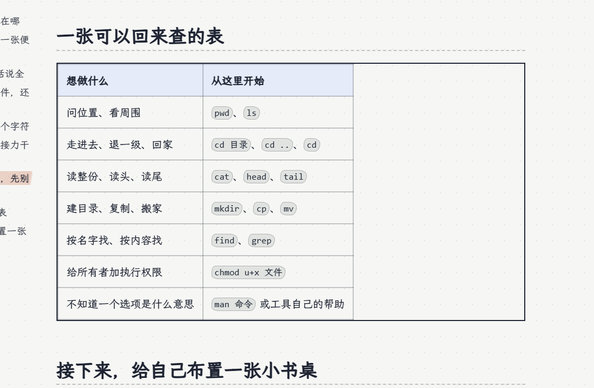
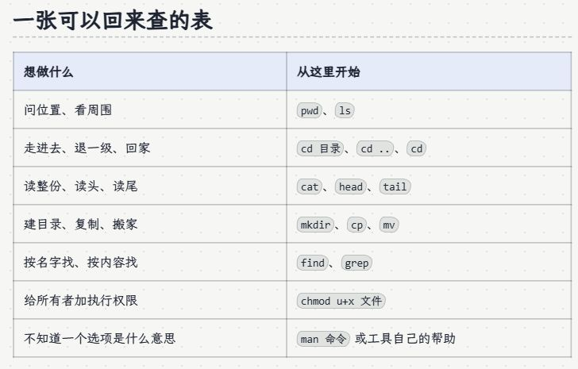

这是这个站点自己的项目页。它不再列一串功能证明“做完了”，而是留下几项会影响下一次更新的决定，以及做决定时看得见的证据。

页面借助 AI 编码与编辑。站长决定内容与设计取舍，代码和文章仍需要实际检查。这里记录的例子来自这次本地修改；尚未把本次修改当成已经上线的版本。

## 选择一：让首页只做它需要做的事

首页曾试着增加按问题串起文章的阅读路径。它解释得通，却让原本的栏目入口和最近更新退到了后面。站长判断它没有必要，于是撤去。

留下来的结构很直接：学术、洞见、日常、资料库与项目各有自己的形态；正文在需要背景的位置给链接，标签和搜索负责继续找内容。

一个可以画出来的入口，未必需要存在。这个决定的验收也很具体：打开首页，仍能找到原有栏目与更新；代码、元数据和内容说明中不再残留那套路径。

:::postit[这次保留下来的原则]
内容的先后关系先在文章里讲清楚。首页的组织承担首页的问题，不替每篇文章增加一套通用教学入口。
:::

## 选择二：文章的准备条件，留在文章里

另一个曾加入的块是“阅读前：适合、准备、读完”。它通过新增的 frontmatter 与组件出现在正文之前，但视觉上不属于原有的笔记本组件，编辑正文时也不容易看见。

这次把它和对应 CMS 字段一起撤去。需要说明环境时，直接写在 Markdown 主线中；需要提醒损失时，用原有警告便利贴；需要补来源时，用页边批注。

**编辑者能看见和理解页面是怎样长出来的，本身就是一种维护能力。** 不能只优化读者的第一眼，把未来编辑的人留在隐含配置里。

## 选择三：公共样式的便利，可能改坏真实内容

手机适配时给表格加上 `display: block`，可以使它成为滚动容器。但在命令行文章中，外框占满正文宽度，内部两列却按内容收缩，右边留下了整块空白。

下面保留发现问题时的截图与修复后的局部。它们是这个站点的实际页面，不是为了比较而画的效果图。

:::photos{cols=2}


:::

修复只撤去表格上的块级布局，把长文本的换行交给单元格。没有改文章里的表，也没有为这一篇添加例外选择器。

:::fold[这次实际改了哪几行]
```css
.prose table {
  width: 100%;
  border-collapse: collapse;
  font-size: 1rem;
}

.prose th,
.prose td {
  overflow-wrap: anywhere;
}
```

表格保持原生布局。桌面截图核对外框与行宽，390px 手机尺寸核对换行与页面宽度。这个检查不代表所有可能的宽表都已覆盖；后续新增长代码或更多列时，仍应打开真实页面。
:::

## 代码怎样给这些决定留空间

内容读取与过滤在 `content.ts`，长文共有的路由、元信息和推荐在 `articles.ts`，正文的页面组织在 `PostLayout.astro`。项目保留自己的父子文档结构，正文与附件住在一起。

这个分工让改一篇文章不必改首页，让统一元信息不必复制三个路由；也让具体文章能够分别使用图解、折页、工作纸或交互模型。不是每一层都要继续拆出新模块，先让职责可解释。

:::steps
1. **正文与附件。** Markdown 保存内容，图片、数据和演示与文章同目录。
2. **读取与渲染。** schema 检查字段，现有笔记本语法组织表达。
3. **页面与索引。** Astro 生成静态页面，Pagefind 索引正文，RSS 保留可读内容。
4. **编辑与预览。** Sveltia CMS 保存仓库内容；本地与后台预览使用同一套正文规则。
:::

## 一次修改，要拿哪几种证据收尾

类型检查能发现字段与接口问题，生产构建能暴露渲染与附件错误，链接检查能发现生成后不存在的路径。它们都不会告诉你，那张表格是否真的好看。

浏览器负责最后这一层：桌面和手机打开页面，实际切页、折页、搜索和操作交互。检查对象不是一个空白的组件演示，而是读者会遇到的真实文章。

留言、评论和 CMS 提交涉及外部服务，不能把本地静态检查写成已经完成了真实发送或登录。本次也没有以自动化测试替站长判断内容是否值得发布。

## 下一篇文章怎样继承这份记录

先确定读者在这篇里要完成哪一种动作，再选形式。坐标问题适合逐条揭开证据，成功率适合图表论证，资源指南适合可带走的工作纸。需要连续操纵状态时，再用交互。

共同标准不是长得一样，而是内容、形式、代码与证据能够互相对得上。这份项目会继续修改；`active` 比“网站搭好了，所以项目结束了”更符合它的现状。
