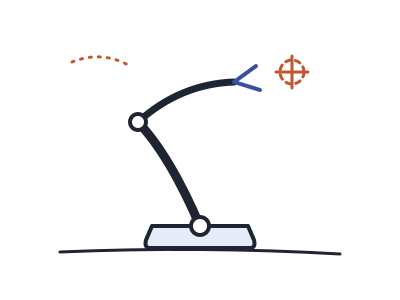
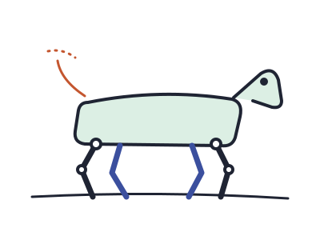

这一页把站点的自定义语法全部用一遍，源码就是说明书。它是一个“项目”，下面挂着一篇文档[《原生 Markdown 的手绘重绘》](markdown/index.md)，两者各有自己的 `attachments/` 文件夹。完整写法见仓库里的 `docs/SYNTAX.md`。

## 页边

行内批注跟着句子走。:note[这条批注在宽屏浮到右侧页边并编号，窄屏点击上标展开。] 需要放多段内容时用块级批注：

:::note[为什么放在页边]
页边是读者眼睛停留的地方，不打断正文，又比脚注近。

可以放列表、公式 $\sqrt{d_k}$ 和图片。
:::

脚注也进页边[^1]，编号和行内批注连续。

[^1]: 这是一个标准 Markdown 脚注，写在文末，渲染时搬到了页边。

## 落在文字上的笔

荧光笔有四种颜色：:mark[默认色随配色变]、:mark[绿]{green}、:mark[粉]{pink}、:mark[黄]{yellow}。

红笔批改：把 :pen[关键词]{circle} 圈出来，给 :pen[需要强调的句子]{wavy} 画波浪线，给 :pen[术语]{box} 加框，把 :pen[写错的地方]{strike} 划掉。自测题的答案可以先 :pen[涂掉，点一下才显示]{hide}。

盖章：:stamp[待验证]、:stamp[已复现]{green}、:stamp[存疑]{blue}。

## 贴在纸上的东西

:::postit[什么时候用便利贴]{tip}
一段需要跳出正文的提醒。类型有提示、注意、说明、疑问四种，也可以不写类型。
:::

:::postit{warn}
不写标题也可以。注意类型用粉色便利贴，说明类型用蓝色。
:::

:::postit[还没想清楚的问题]{question}
疑问类型是虚线边框的白纸，留给自己以后回答。
:::

:::photos{cols=3}

:::

:::photos{scatter}

:::

:::fold[展开看一份长清单]
折页适合放不想一开始就占满屏幕的内容。

- [x] 页边批注
- [x] 便利贴
- [ ] 更多相片样式
:::

::bookmark[remark-directive]{url=https://github.com/remarkjs/remark-directive desc="这套语法的解析器：一个冒号行内，两个冒号独占一行，三个冒号包住段落"}

## 步骤与时间线

:::steps
1. 在 `src/markdown/directives.mjs` 登记一个名字和它的渲染函数。
2. 在 `src/styles/markdown.css` 写样式，后台预览样式会自动跟着生成。
3. 在 `public/admin/components.js` 加一个同名按钮，再到 `docs/SYNTAX.md` 补一段说明。
4. `npm test` 会检查这三处是否对齐。
:::

:::steps{timeline}
1. **2026-09-21** 页边批注和荧光笔改成 Markdown 指令，文章从此可以在后台编辑。
2. **2026-09-22** 附件跟着文章走，语法扩展成一个家族，这一页诞生。
:::

## 版式

:::layout{cols=2}
左边一栏。分栏在手机上会变回单栏，所以每栏放独立的段落最稳妥。

右边一栏。适合并排放两张图或两段对照的文字。
:::

:::layout{wide}
| 指令 | 位置 | 变体 |
| --- | --- | --- |
| `:mark[]` | 行内 | green / pink / yellow |
| `:pen[]` | 行内 | circle / wavy / box / strike / hide |
| `:stamp[]` | 行内 | red / blue / green |
| `:::postit` | 段落 | tip / warn / info / question |
| `:::photos` | 段落 | cols= / scatter |
| `::video` | 独占一行 | src= / youtube= / bilibili=，loop |
| `::embed` | 独占一行 | page= / snippet=，height= |
:::

## 视频与嵌入

::video[附件里的视频文件：静音自动循环]{src=./attachments/arm-demo.mp4 poster=./attachments/arm-demo-poster.webp loop}

::video[YouTube 示例：页面打开时不向站外发请求，点击封面后才加载播放器]{youtube=dQw4w9WgXcQ}

::embed[一个交互演示：两连杆机械臂跟着指针做逆运动学，颜色随站点配色变化]{page=./attachments/ik-arm}

::embed[片段：一段带 CSS 动画的 SVG，直接嵌进正文]{snippet=./attachments/sketch.html}

嵌入页面是附件里的一个文件夹，有自己的 `index.html`，站点只负责把它放进相框并同步配色。想看它的源码，打开 [`attachments/ik-arm/index.html`](./attachments/ik-arm/index.html)。
